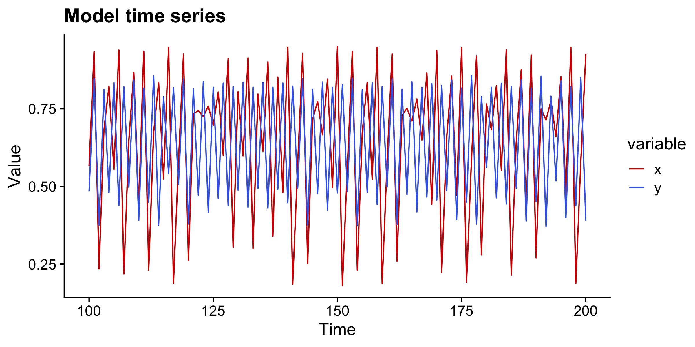
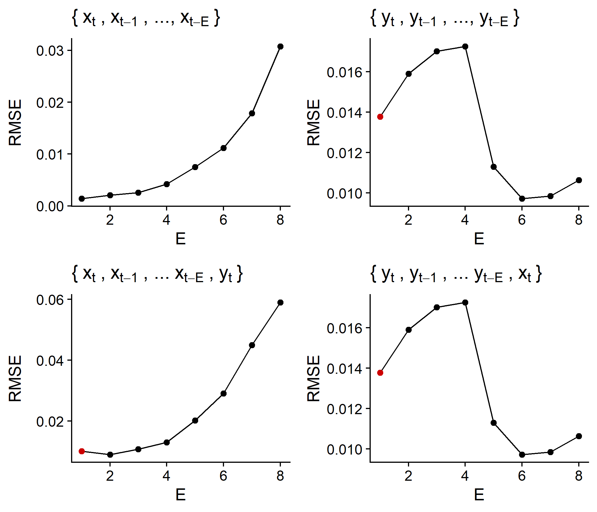
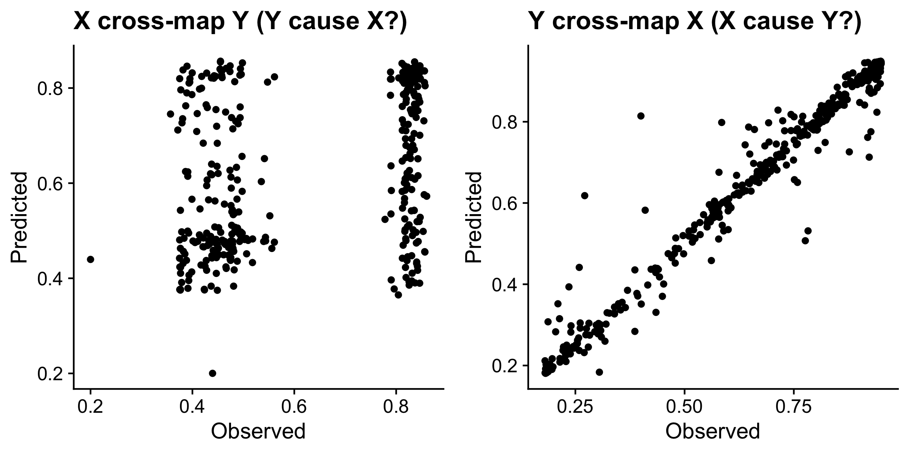
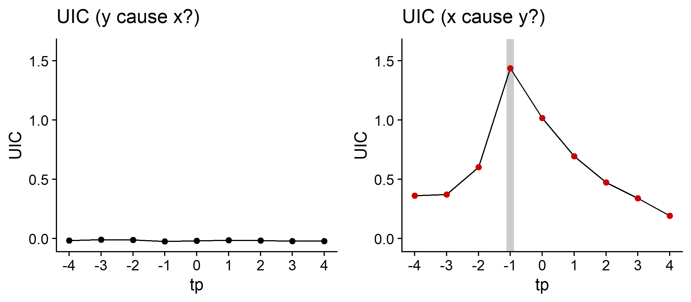

# rUIC : Unified Information-theoretic Causality for R

Quick manual of rUIC package

(for deails, see the package manual)

## Installation
1. Click "clone or download" and download the zip file.
2. Decompress the zip file in a working directory. "ruic-master" folder will be created.
3. Excute the following command.
``` r
library(devtools)
devtools::install(pkg = 'rUIC-master', reload = TRUE, quick = FALSE)
```
4. A quick demo

- Load library and generate model time series
```r
library(rUIC); packageVersion("rUIC") # v0.1.2

## simulate logistic map
tl <- 400  # time length
x <- y <- rep(NA, tl)
x[1] <- 0.4
y[1] <- 0.2
for (t in 1:(tl - 1)) {  # causality : x -> y
    x[t+1] = x[t] * (3.8 - 3.8 * x[t] - 0.0 * y[t])
    y[t+1] = y[t] * (3.5 - 3.5 * y[t] - 0.1 * x[t])
}
block = data.frame(t = 1:tl, x = x, y = y)
```
<figure>

<figcaption><font size=1><i>Figure 1 | Model time series. Red and blue lines indicate time series of x and y, respectively.</i></font></figcaption>
</figure>


- Perform simplex projection and determine the optimal embedding dimension
```r
# No.1: Determine the optimal embedding dimension using simplex projection
## Univariate UIC-version simplex projection
simp_x <- rUIC::simplex(block, lib_var = "x", E = 1:8, tau = 1, tp = -1, n_boot = 2000)
simp_y <- rUIC::simplex(block, lib_var = "y", E = 1:8, tau = 1, tp = -1, n_boot = 2000)

## Multivariate rUIC-version simplex projection
simp_xy <- rUIC::simplex(block, lib_var = "x", cond_var = "y", E = 1:8, tau = 1, tp = -1, n_boot = 2000)
simp_yx <- rUIC::simplex(block, lib_var = "y", cond_var = "x", E = 1:8, tau = 1, tp = -1, n_boot = 2000)

# Select the optimal embedding dimension (Here RMSE is used as a criteria; UIC may be used as a criteria)
Exy <- simp_xy[which.min(simp_xy[simp_xy$pval < 0.05,]$rmse), "E"]
Eyx <- simp_yx[which.min(simp_yx[simp_yx$pval < 0.05,]$rmse), "E"]
```

<figure>

<figcaption><font size=1><i>Figure 2 | RMSE of simplex projection. Simplex projections were performed using different embeddings: {x<sub>t</sub>, x<sub>t-1</sub>, ...} (top-left), {y<sub>t</sub>, y<sub>t-1</sub>, ...} (top-right), {x<sub>t</sub>, x<sub>t-1</sub>, ..., y<sub>t</sub>} (bottom-left) and {y<sub>t</sub>, y<sub>t-1</sub>, ..., x<sub>t</sub>} (bottom-right). Red points indicate significant improvements in forecasting skill compared with one less embedding dimensions. For example, a red point in the top-left panel means that RMSE at E = 2 significantly improved than that at E = 1 while RMSE at E = 3 is not significantly better than RMSE at E = 2, suggesting that the optimal embedding dimension for x is 2.</i></font></figcaption>
</figure>


The optimal embedding dimensions are determined based on multivariate simplex projection.


- Perform cross-mapping
```r
# No.2: Cross-map
xmap_xy <- rUIC::xmap(block, lib_var = "x", tar_var = "y", E = Exy, tau = 1, tp = -1)
xmap_yx <- rUIC::xmap(block, lib_var = "y", tar_var = "x", E = Eyx, tau = 1, tp = -1)
```
<figure>

<figcaption><font size=1><i>Figure 3 | Predicted and observed values based on cross-mapping. Red dashed lines indicate 1:1 line.</i></font></figcaption>
</figure>


Cross mapping show that `x` can be accurately predicted from `y` (left panel), suggesting that `x` causally influences `y`. On the other hand, `y` cannot be predicted from `x`, suggesting that  `y` does not have causal influences on `x`.


- Compute UIC for different time-lag (`tp`)
```r
# No.3: Compute UIC
uic_xy <- rUIC::uic(block, lib_var = "x", tar_var = "y", E = Exy + 1, tau = 1, tp = -4:5, n_boot = 2000)
uic_yx <- rUIC::uic(block, lib_var = "y", tar_var = "x", E = Eyx + 1, tau = 1, tp = -4:5, n_boot = 2000)

```
<figure>

<figcaption><font size=1><i>Figure 4 | UIC at different time-lags (tp). Red points indicate significant UIC values. Gray region in the right panel indicate the largest UIC among the tested time-lags, which suggests that causal influences from x to y occur at time lag -1.</i></font></figcaption>
</figure>


## Functions implemented in rUIC package
- `simplex`: Perform simplex projection and return statistics only.
    - `E`, `tau`, `tp`, and `nn` accept vectors. All possible combinations of  `E`, `tau`, and `tp` are used.
    - Potential causal variable should be specified by `tar_var` augument.
    - Return _p_ value if `n_boot > 1`.
    - _p_ value indicates "Probability of the improvements of prediction compared with when one less embedding dimension is used" as specified in the following inequality:
    **_p(x<sub>t+tp</sub> | y<sub>t</sub>, x<sub>t</sub>, x<sub>t-&tau;</sub>, ... x<sub>t-(E-1)&tau;</sub>) > p(x<sub>t+tp</sub> | y<sub>t</sub>, x<sub>t</sub>, x<sub>t-&tau;</sub>, ... x<sub>t-(E-2)&tau;</sub>)_**

- `xmap`: Perform cross-mapping and return model predictions and statistics.
    - `E`, `tau`, `tp`, and `nn` accept a scalar value only.
    - Potential causal variable should be specified by `tar_var` augument.
    - Specify `cond_var` augument for the multivariate version of `xmap`.

- `uic`: Perform uic and return statistics only.
    - `E` should be an optimal embedding dimension (estimated by `simplex`) + 1.
    - `E`, `tau`, `tp`, and `nn` accept vectors. All possible combinations of  `E`, `tau`, and `tp` are used.
    - Potential causal variable should be specified by `tar_var` augument.
    - Return _p_ value if `n_boot > 1`.
    - _p_ value indicates "Probability that y causes x in the sense of transfer entropy" as specified in the following inequality:
    **_p(x<sub>t+tp</sub> | x<sub>t+1</sub>, x<sub>t</sub>, x<sub>t-&tau;</sub>, ... x<sub>t-(E-2)&tau;</sub>) > p(x<sub>t+tp</sub> |  x<sub>t</sub>, x<sub>t-&tau;</sub>, ... x<sub>t-(E-2)&tau;</sub>)_**

## Important arguments in rUIC package

Arguments identical with those used in rEDM package are currently not explained. For arguments used in rEDM package, please see the rEDM tutorial (https://ha0ye.github.io/rEDM/index.html). See the package manual for details.

- `lib_var` : the name or column index of library data
    - A variable to be used for time-delay embedding.

- `tar_var` : the name or column index of target data
    - A variable to be predicted (same with `target_column` argument in rEDM).

- `cond_var` : the name or column index of condition data
    - A third variable to be used for multivariate prediction, or detection of indirect interactions.

- `nn` : the number of neighbors used for prediction
    - `num_neighbors` argument in rEDM.
    - `"e+1"` may be used. If a scalar value is specified, nn = rep(nn, length(E+1)).
    - If vector is specified and if `length(E) != length(nn)`, error will be returned.

- `n_boot` :  the number of bootstrap to be used for computing p-value  
    - The number of bootstrap to calculate p value.

- `scaling` : the local scaling (neighbor, velocity, no_scale)
    - **This argument is experimental. May be changed in near future.**
    - Method for local scaling of distance matrix. Implemented to improve noise-robustness.

- `is_naive` : whether rEDM-style estimator is used
    - **This argument is experimental. May be changed in near future.**
    - Whether to return not-corrected RMSE （naive estimator） (estimator that is not corrected using neighbors)
    - If `TRUE`, the result will be similar to Convergent Cross Mapping (CCM)

## Outputs in rUIC package
- `E` : Embedding dimension
- `tau` : Time-lag for attractor reconstruction (NOT time-lag of causal influence)
- `tp` : Time prediction horizon (interpreted as time-lag of causal influence)
- `nn` : The number of nearest neighbors
- `n_lib` : The number of time indices used for attractor reconstruction
- `n_pred` : The number of time indices used for model predictions
- `rmse` : Unbiased Root Mean Squared Error (RMSE)
- `te` : Transfer entropy
- `pval` : Bootstrap p-value for `te` > 0
