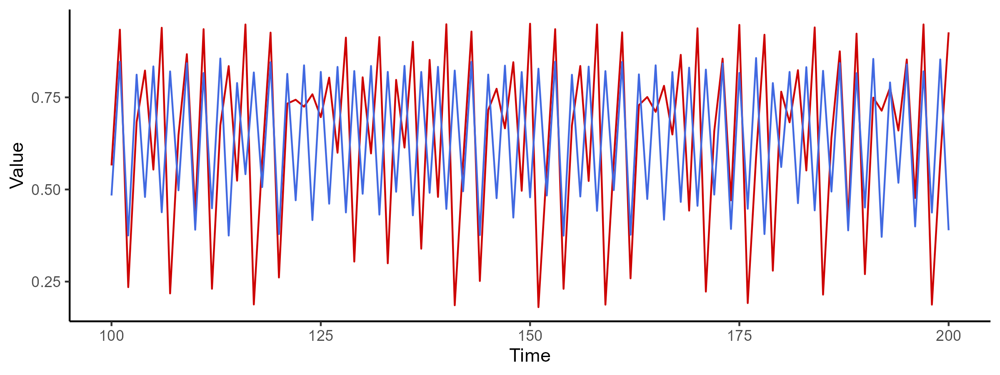
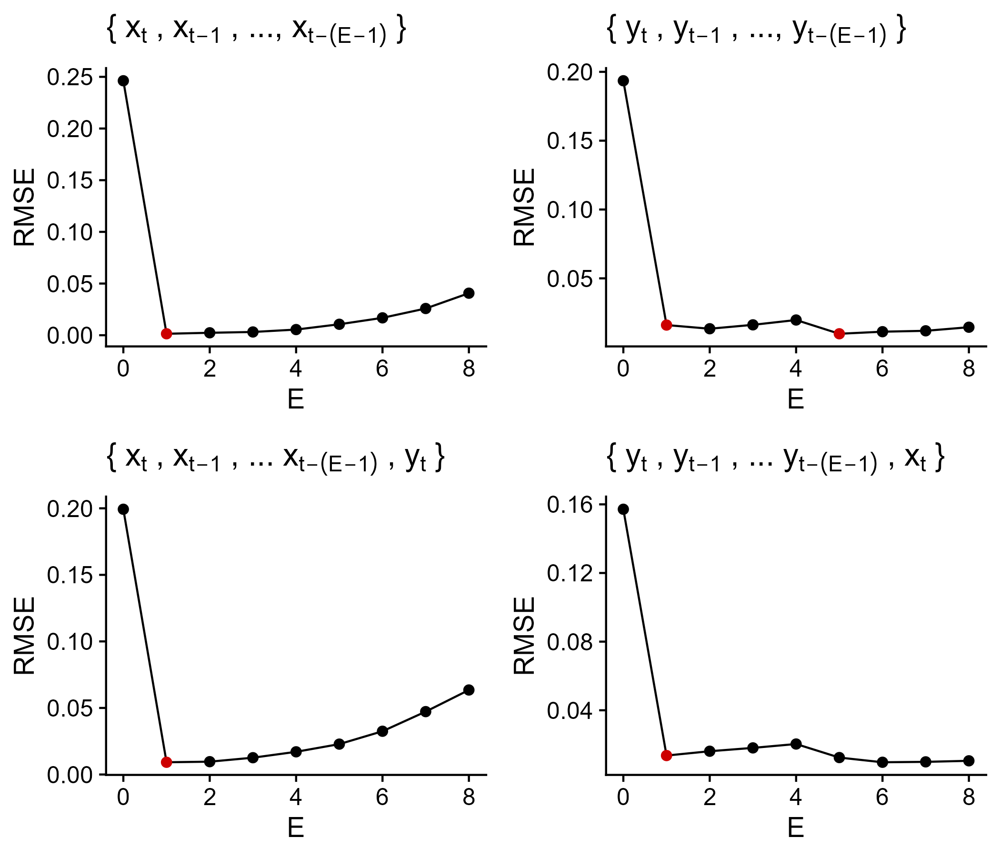
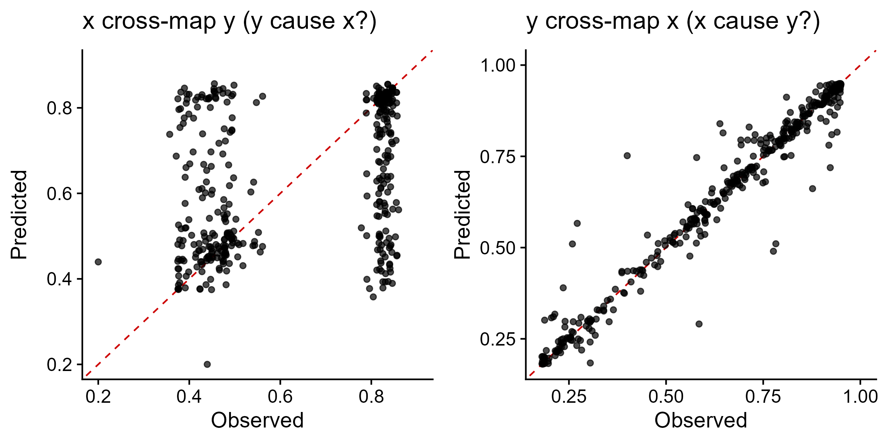
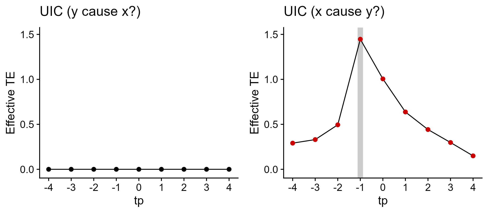
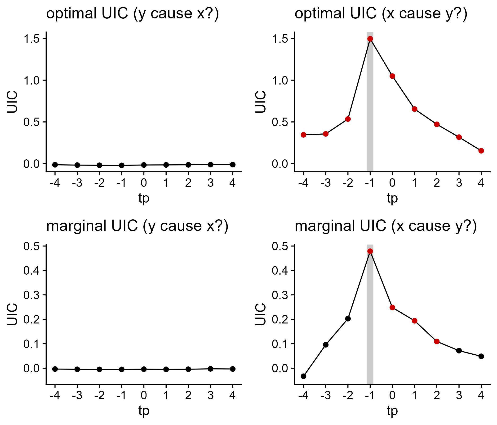

# rUIC : Unified Information-theoretic Causality for R

For japanese, please see https://github.com/yutakaos/archives/tree/master/jp/uic/.

## Installation
``` r
library(remotes)
remotes::install_github("yutakaos/rUIC")
```
## Quick tutorials

### Load library and generate model time-series
```r
library(rUIC); packageVersion("rUIC") # v0.9.11

# simulate logistic map
tl <- 400  # time length
x <- y <- rep(NA, tl)
x[1] <- 0.4
y[1] <- 0.2
for (t in 1:(tl - 1)) {  # causality : x -> y
    x[t+1] = x[t] * (3.8 - 3.8 * x[t] - 0.0 * y[t])
    y[t+1] = y[t] * (3.5 - 3.5 * y[t] - 0.1 * x[t])
}
block = data.frame(t=1:tl, x=x, y=y)
```

<figure>

<figcaption><i>Figure 1 | Model time-series. Red and blue lines indicate time-series of x and y, respectively.</i></figcaption>
</figure>
 

### Perform simplex projection and determine the optimal embedding dimension
```r
## Univariate simplex projection
simp_x <- simplex(block, lib_var="x", E=0:8, tau=1, tp=1, alpha=0.05)
simp_y <- simplex(block, lib_var="y", E=0:8, tau=1, tp=1, alpha=0.05)

## Multivariate simplex projection
simp_xy <- simplex(block, lib_var="x", cond_var="y", E=0:8, tau=1, tp=1, alpha=0.05)
simp_yx <- simplex(block, lib_var="y", cond_var="x", E=0:8, tau=1, tp=1, alpha=0.05)

# Determine the optimal embedding dimension
Exy <- with(simp_xy, max(c(0, E[pval < 0.05]))) + 1
Eyx <- with(simp_yx, max(c(0, E[pval < 0.05]))) + 1
```
The optimal embedding dimension used for `rUIC::uic` should be determined based on multivariate simplex projection.<br>

<figure>

<figcaption><i>Figure 2 | Results of simplex projection. Simplex projections were performed using different embeddings: {x<sub>t</sub>, x<sub>t-1</sub>, ..., x<sub>t-(E-1)</sub>} (top-left), {y<sub>t</sub>, y<sub>t-1</sub>, ..., y<sub>t-(E-1)</sub>} (top-right), {x<sub>t</sub>, x<sub>t-1</sub>, ..., x<sub>t-(E-1)</sub>, y<sub>t</sub>} (bottom-left) and {y<sub>t</sub>, y<sub>t-1</sub>, ..., y<sub>t-(E-1)</sub>, x<sub>t</sub>} (bottom-right). Red points indicate significant improvements in forecasting skill (RMSE). </i></figcaption>
</figure>


### Perform cross-mapping
```r
xmap_xy <- xmap(block, lib_var="x", tar_var="y", E=Exy, tau=1, tp=-1)
xmap_yx <- xmap(block, lib_var="y", tar_var="x", E=Eyx, tau=1, tp=-1)
```
Cross mapping shows that x can be accurately predicted from y (right panel) while y cannot be predicted from x (left panel). It suggests that the system has the unidirectional causal influence from x to y.

<figure>

<figcaption><i>Figure 3 | Predicted and observed values based on cross-mapping. Red dashed lines indicate a 1:1 line. </i></figcaption>
</figure>


### Compute UIC for different time-lag
```r
uic_xy <- uic(block, lib_var="x", tar_var="y", E=Exy, tau=1, tp=-4:4)
uic_yx <- uic(block, lib_var="y", tar_var="x", E=Eyx, tau=1, tp=-4:4)
```
The result suggests that x causally drives y and the optimal time-lag is 1, being consistent with the model equations.

<figure>

<figcaption><i>Figure 4 | UIC results at different time-lags (tp). Red points indicate UIC values (TEs) are significant. Gray region in the right panel indicate the largest UIC value among the tested time-lags, which suggests that causal influence from x to y occur at time-lag 1 (i.e., the causal time-lag = -tp). </i></figcaption>
</figure>


### Wrapper functions for computing UIC

In rUIC package, a wrapper functions is implemented to compute UIC without manually exploring embedding dimensions. `rUIC::uic.optimal` compute UIC by the optimal embedding dimension, which returns the same results as No.3.

```r
## compute UIC using optimal embedding dimension (the same results as No.3)
uic_opt_xy <- uic.optimal(block, lib_var="x", tar_var="y", E=0:8, tau=1, tp=-4:4)
uic_opt_yx <- uic.optimal(block, lib_var="y", tar_var="x", E=0:8, tau=1, tp=-4:4)
```

<figure>

<figcaption><i>Figure 5 | UIC results at different time-lags (tp) using rUIC::uic.optimal (top). Red points indicate that UIC values are significant. Gray region in the right panels indicate the largest UIC value among the tested time-lags. </i></figcaption>
</figure>


## Functions implemented in rUIC package
- `simplex`: Perform simplex projection and return statistics only.
    - `E`, `tau` and `tp` accept vectors. All possible combinations of  `E`, `tau`, and `tp` are used.
    - Potential causal variables should be specified by `cond_var`.
    - _te_ value of simplex projection is expressed as follows:<br>
**log _p_(_x<sub>t+tp</sub>_ | _y<sub>t</sub>_, _x<sub>t</sub>_, _x<sub>t-&tau;</sub>_, ... _x<sub>t-(E-1)&tau;</sub>_) - log _p_(_x<sub>t+tp</sub>_ | _y<sub>t</sub>_, _x<sub>t</sub>_, _x<sub>t-&tau;</sub>_, ... _x<sub>t-(E0-1)&tau;</sub>_)**,<br>
    where **_x<sub>t</sub>_** is `lib_var` and **_y<sub>t</sub>_** is `cond_var`.
    - `pval` in the output indicates _p_ value to test alternative hypothesis _te_ > 0, which means that **the full model improves forecast skills compared to reference (null) model**.

- `xmap`: Perform cross-mapping and return model predictions.
    - `E`, `tau` and `tp` accept a scalar value only.
    - Potential causal variables should be specified by `tar_var`.
    - Specify `cond_var` for the multivariate cross-mapping.

- `uic`: Perform uic and return statistics only.
    - `E`, `tau` and `tp` accept vectors. All possible combinations of  `E`, `tau`, and `tp` are used.
    - Potential causal variables should be specified by `tar_var`.
    - Specify `cond_var` for the multivariate UIC.
    - _te_ value of uic is expressed as follows:<br>
**log _p_(_y<sub>t+tp</sub>_ | _x<sub>t</sub>_, _x<sub>t-&tau;</sub>_, ... _x<sub>t-(E-1)&tau;</sub>_, _z<sub>t</sub>_) - log _p_(_y<sub>t+tp</sub>_ | _x<sub>t-&tau;</sub>_, _x<sub>t-2&tau;</sub>_, ... _x<sub>t-(E-1)&tau;</sub>_, _z<sub>t</sub>_)**,<br>
    where **_x<sub>t</sub>_** is `lib_var`, **_y<sub>t</sub>_** is `tar_var` and **_z<sub>t</sub>_** is `cond_var`.
    - `pval` in the output indicates _p_ value to test alternative hypothesis _te_ > 0, which means **y causes x in the sense of transfer entropy**.

- `uic.optimal`: Wrapper function for computing UIC, which return statistics only.
    - `E`, `tau` and `tp` accept vectors. All possible combinations of  `E`, `tau`, and `tp` are used.
    - UIC is computed using the optimal embedding dimension.
    - Potential causal variables should be specified by `tar_var`.
    - Specify `cond_var` for the multivariate UIC.


## Function arguments in rUIC package

Several arguments in rUIC package is identical with those used in rEDM package. We explain only unique arguments below. For other arguments, please see the rEDM tutorial (https://ha0ye.github.io/rEDM/index.html).

- `lib_var` : the name or column index of library data
    - A variable to be used for time-delay embedding.

- `tar_var` : the name or column index of target data
    - A variable to be predicted (same with **target_column** in rEDM package).

- `cond_var` : the name or column index of conditional data
    - A third variable to be used for multivariate prediction or detection of indirect interactions.

- `nn` : the number of neighbors used for prediction
    - **num_neighbors** argument in rEDM package.
    - "e+1" can be used if nn = E + 1.

- `is_naive` : whether rEDM-style estimator is used
    - Whether to return naive estimator.
    - If FALSE, the estimator bias is adjusted using weights of neighbors.
    - If TRUE, the result will be similar to Convergent Cross Mapping (CCM) in rEDM package.


## Outputs from functions

| Statistics |                                                              |
| -----------| ------------------------------------------------------------ |
| `E`        | Embedding dimension                                          |
| `E0`       | Embedding dimension of reference model                       |
| `tau`      | Time-lag for attractor reconstruction                        |
| `tp`       | Time prediction horizon                                      |
| `nn`       | The number of nearest neighbors                              |
| `n_lib`    | The number of time indices used for attractor reconstruction |
| `n_pred`   | The number of time indices used for model predictions        |
| `rmse`     | Root mean squared error (RMSE)                               |
| `te`       | Transfer entropy (i.e., information flow)                    |
| `ete`      | Effective transfer entropy (original TE - surrogate TE)      |
| `pval`     | The _p_ value to test alternative hypothesis, te > 0         |
| `n_surr`   | The number of surrogate data generated to compute _p_ value  |
