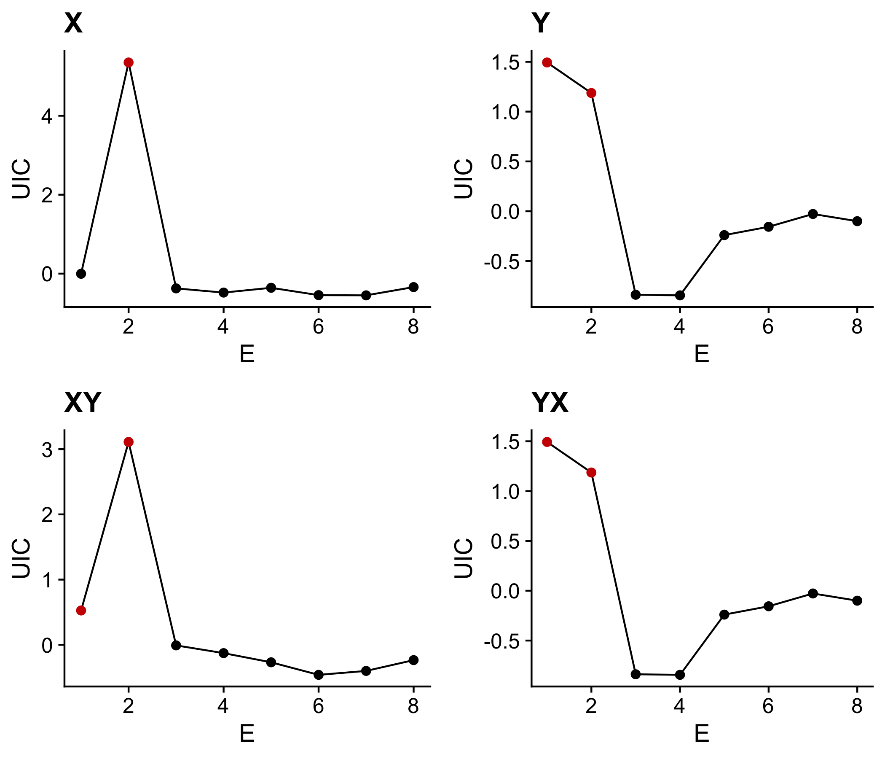

# rUIC : Unified Information-theoretic Causality for R

Tentative manual of rUIC package.

## Installation
1. Click "clone or download" and download the zip file.
2. Decompress the zip file in a working directory. "ruic-master" folder will be created.
3. Excute the following command.
``` r
library(devtools)
devtools::install(pkg = 'ruic-master', reload = TRUE, quick = FALSE)
``` 
4. A quick demo

- Load library and generate model time series
```r
library(ruic); packageVersion("ruic") # v0.1

## simulate logistic map
tl <- 400  # time length
x <- y <- rep(NA, tl)
x[1] <- 0.4
y[1] <- 0.2
for (t in 1:(tl - 1)) {  # causality : x -> y
    x[t+1] = x[t] * (3.8 - 3.8 * x[t] - 0.0 * y[t])
    y[t+1] = y[t] * (3.5 - 3.5 * y[t] - 0.1 * x[t])
}
block = data.frame(t = 1:tl, x = x, y = y)
```


- 
```r
# No.1: Determine the optimal embedding dimension using simplex projection
## Univariate UIC-version simplex projection
simp_x <- ruic::simplex(block, x_column = "x", E = 1:8, tau = 1, tp = -1, n_boot = 2000)
simp_y <- ruic::simplex(block, x_column = "y", E = 1:8, tau = 1, tp = -1, n_boot = 2000)

## Multivariate UIC-version simplex projection
simp_xy <- ruic::simplex(block, x_column = "x", y_column = "y", E = 1:8, tau = 1, tp = -1, n_boot = 2000)
simp_yx <- ruic::simplex(block, x_column = "y", y_column = "x", E = 1:8, tau = 1, tp = -1, n_boot = 2000)

# Select the optimal embedding dimension (RMSE or UIC?)
Exy <- simp_xy[which.min(simp_xy[simp_xy$pval < 0.05,]$rmse), "E"]
Eyx <- simp_yx[which.min(simp_yx[simp_yx$pval < 0.05,]$rmse), "E"]
```



```r
# No.2: Cross-map
xmap_xy <- ruic::xmap(block, x_column = "x", y_column = "y", E = Exy, tau = 1, tp = -1)
xmap_yx <- ruic::xmap(block, x_column = "y", y_column = "x", E = Eyx, tau = 1, tp = -1)

```


```r
# No.3: Compute UIC
uic_xy <- ruic::uic(block, x_column = "x", y_column = "y", E = Exy + 1, tau = 1, tp = -4:5, n_boot = 2000)
uic_yx <- ruic::uic(block, x_column = "y", y_column = "x", E = Eyx + 1, tau = 1, tp = -4:5, n_boot = 2000)

```


## Functions implemented in rUIC package

- `xmap`
　Perform cross-mapping and return model predictions and statistics.
    - `E`, `tau`, `tp`, and `nn` accept a scalar value only.
    - Potential causal variable should be specified by `y_column` augument.
    - Specify `z_column` augument for the multivariate version of `xmap`.

- `simplex`
　Perform simplex projection and return statistics only.
    - `E`, `tau`, `tp`, and `nn` accept vectors. All possible combinations of  `E`, `tau`, and `tp` are used.
    - Potential causal variable should be specified by `y_column` augument.
    - Return _p_ value if `n_boot > 1`.
    - _p_ value indicates "Probability of the improvements of prediction compared with when one less embedding dimension is used" as specified in the following inequality:
    **_p(x<sub>t+tp</sub> | y<sub>t</sub>, x<sub>t</sub>, x<sub>t-&tau;</sub>, ... x<sub>t-(E-1)&tau;</sub>) > p(x<sub>t+tp</sub> | y<sub>t</sub>, x<sub>t</sub>, x<sub>t-&tau;</sub>, ... x<sub>t-(E-2)&tau;</sub>)_**

- `uic`
　Perform uic and return statistics only.
    - `E` should be an optimal embedding dimension (estimated by `simplex`) + 1.
    - `E`, `tau`, `tp`, and `nn` accept vectors. All possible combinations of  `E`, `tau`, and `tp` are used.
    - Potential causal variable should be specified by `y_column` augument.
    - Return _p_ value if `n_boot > 1`.
    - _p_ value indicates "Probability that y causes x in the sense of transfer entropy" as specified in the following inequality:
    **_p(x<sub>t+tp</sub> | x<sub>t+1</sub>, x<sub>t</sub>, x<sub>t-&tau;</sub>, ... x<sub>t-(E-2)&tau;</sub>) > p(x<sub>t+tp</sub> |  x<sub>t</sub>, x<sub>t-&tau;</sub>, ... x<sub>t-(E-2)&tau;</sub>)_**

## Arguments in rUIC package

Arguments identical with those used in rEDM package are currently not explained. For arguments used in rEDM package, please see the rEDM tutorial (https://ha0ye.github.io/rEDM/index.html).

- `x_column` : the name or column index of library data
    - A variable to be used for time-delay embedding.

- `y_column` : the name or column index of target data
    - A variable to be predicted (`target_column` argument in rEDM).

- `z_column` : the name or column index of condition data
    - A third variable to be used for multivariate prediction, or detection of indirect interactions.

- `nn` : the number of neighbors used for prediction
    - `num_neighbors` argument in rEDM.
    - `"e+1"` may be used. If a scalar value is specified, nn = rep(nn, length(E+1)).
    - If vector is specified and if `length(E) != length(nn)`, error will be returned.

- `n_boot` :  the number of bootstrap to be used for computing p-value  
    - The number of bootstrap to calculate p value.

- `scaling` : the local scaling (neighbor, velocity, no_scale)
    - **This argument is experimental. May be changed in near future.**
    - Method for local scaling of distance matrix. Implemented to improve noise-robustness.

- `is_naive` : whether rEDM-style estimator is used
    - **This argument is experimental. May be changed in near future.**
    - Whether to return not-corrected RMSE （naive estimator） (estimator that is not corrected using neighbors)
    - If `TRUE`, the result will be similar to Convergent Cross Mapping (CCM)

